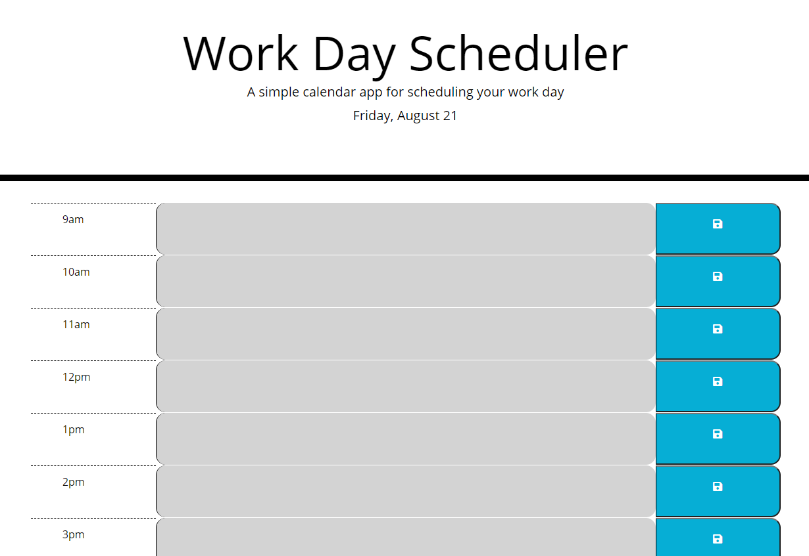

## Table of contents
* [Day-Planner](#Day-Planner)
* [Technologies](#technology)
* [Collaborators](#collaborators)
* [Day Planner Website](https://toveson.github.io/Day-Planner/)

# Day-Planner

This is a simple day planner for a normal work day from 9am to 5 pm. It allows the user to save events in the center column by entering what they would like and clicking the save button to the right. The users saved items will still be there even if they refresh the page.

## technologies
* HTML
* CSS
* jQuery
* moment.js
* Bootstap
* font awesome

## Home Page

this [Day Planner](https://toveson.github.io/Day-Planner/) is hosted on Github pages.

## Collaborators
This application was authored by [Trever Oveson](https://github.com/toveson).

HUGE thank you to Chrisopher Sannar for helping me wrap my head around some new concepts for color change function!